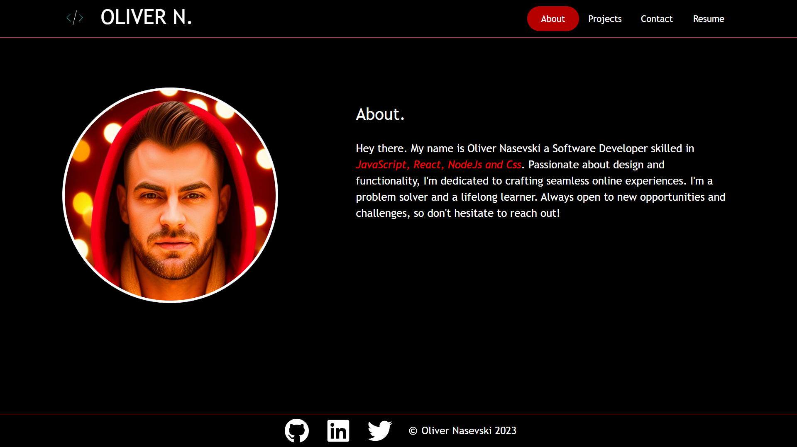

# Personal Portfolio - React

---

## Description

Portfolio webpage built with REACT.\
The Navigation has 4 sections (ABOUT, PROJECTS, CONTACT, RESUME) with a corresponding content that shows when the section is selected. 
 

---

## Table Of Contents
                             
- [Description](#description)
- [Usage](#usage)
- [License](#license)
- [Questions](#questions)

---

## Usage

Here's a direct link for the [Portfolio.](https://oliver-n.netlify.app/)

## License

This Project is licenced under MIT license.

---

## Questions

You can find more about my work at my Github [oliver23n](https://github.com/oliver23n).

